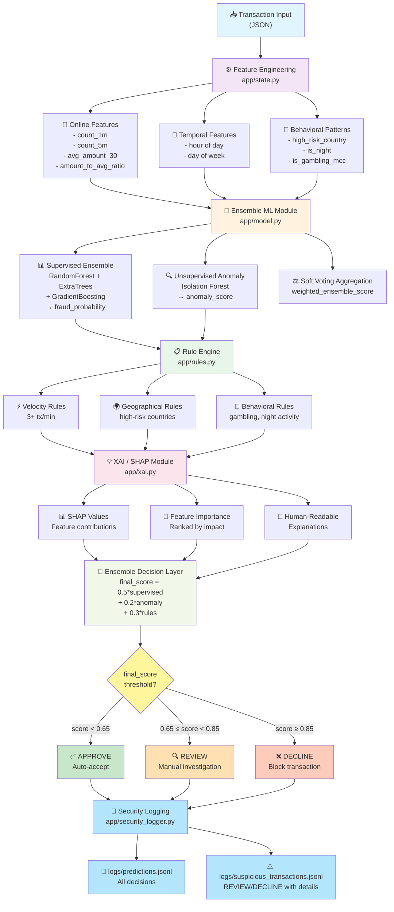
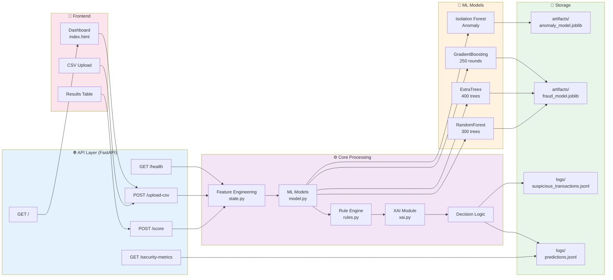
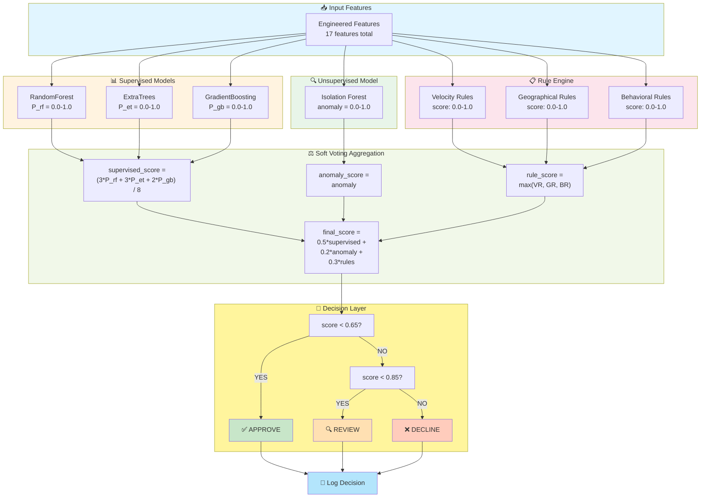
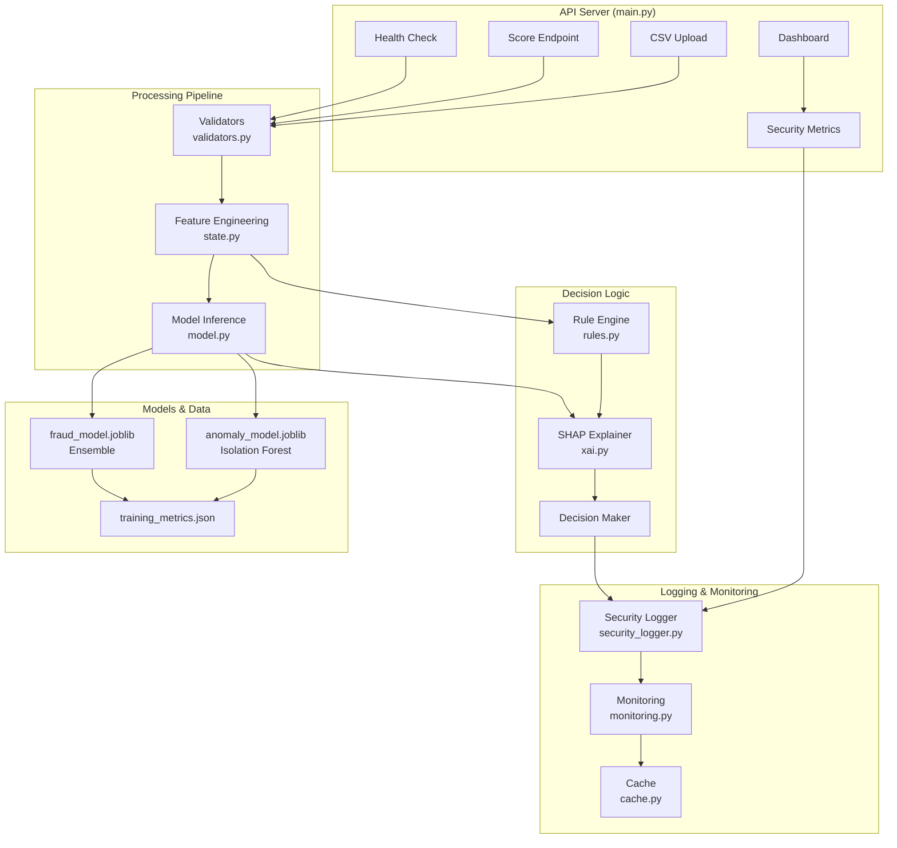
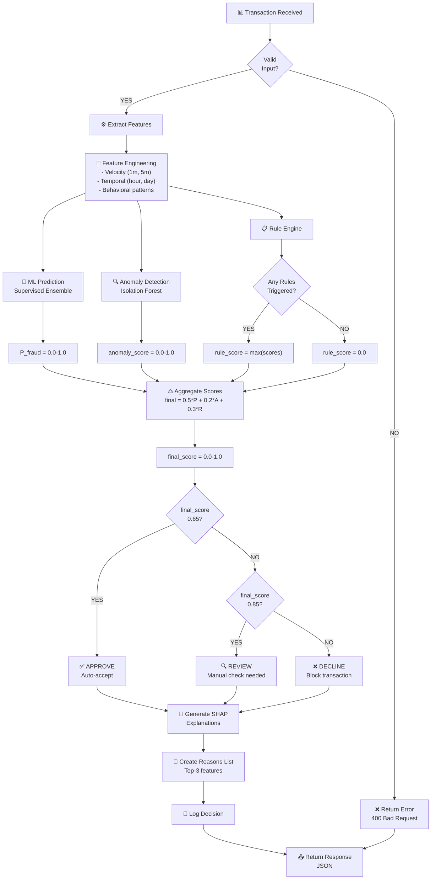
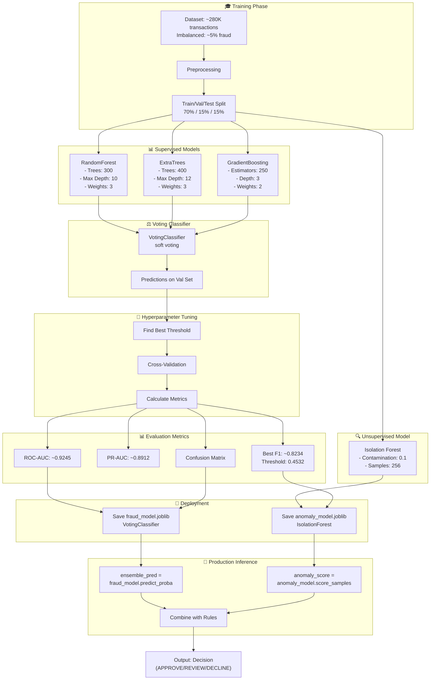
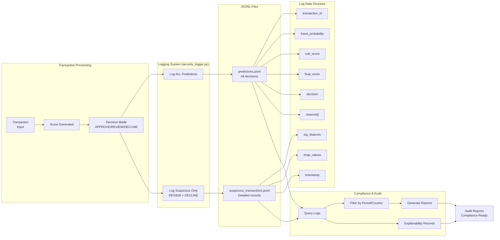

# Руководство по диаграммам системы

## 📋 Содержание

Этот документ содержит все диаграммы архитектуры, потоков данных и компонентов системы детектирования мошенничества в реальном времени.

---

## 🔄 1. Диаграмма потока данных (Data Flow)

**Файл**: `01_dataflow.md`

Полный путь от получения транзакции до логирования решения:



**Ключевые этапы**:

1. Получение входных данных транзакции в JSON формате
2. Извлечение и инженерия признаков (17 признаков)
3. Предсказание через ансамбль ML моделей
4. Обнаружение аномалий (Isolation Forest)
5. Применение правил (velocity, geographical, behavioral)
6. Генерация SHAP объяснений
7. Агрегация оценок (0.5*supervised + 0.2*anomaly + 0.3\*rules)
8. Финальное решение (APPROVE/REVIEW/DECLINE)
9. Логирование в JSONL файлы

---

## 🏗️ 2. Архитектура системы

**Файл**: `02_architecture.md`

Высокоуровневая архитектура компонентов:



**Компоненты**:

- **API Layer**: FastAPI endpoints для взаимодействия
- **Core Processing**: Основные модули обработки
- **ML Models**: Четыре модели (RandomForest, ExtraTrees, GradientBoosting, Isolation Forest)
- **Storage**: Хранение моделей и логов
- **Frontend**: Web интерфейс для пользователей

---

## ⚖️ 3. Ансамблевое голосование

**Файл**: `03_ensemble_voting.md`

Механизм soft voting и агрегации оценок:



**Формулы**:

- Supervised score = (3*P_rf + 3*P_et + 2\*P_gb) / 8
- Anomaly score = Isolation Forest output ∈ [0, 1]
- Rule score = max(velocity_score, geo_score, behavioral_score)
- **Final score = 0.5 × supervised + 0.2 × anomaly + 0.3 × rules**

---

## 🔧 4. Диаграмма компонентов

**Файл**: `04_components.md`

Детальное распределение компонентов по модулям:



---

## 📊 5. Дерево решений

**Файл**: `05_decision_tree.md`

Полный процесс принятия решения для одной транзакции:



---

## 🎓 6. Обучение и развертывание моделей

**Файл**: `06_model_ensemble.md`

Процесс обучения, тюнинга и развертывания моделей:



---

## 🔐 7. Система логирования и аудита

**Файл**: `07_security_logging.md`

Полная система логирования для соответствия требованиям compliance:



---

## 📊 Итоговая таблица метрик

| Метрика                 | Значение |
| ----------------------- | -------- |
| ROC-AUC                 | ~0.9245  |
| PR-AUC                  | ~0.8912  |
| Best F1 Score           | ~0.8234  |
| F1 Threshold            | 0.4532   |
| APPROVE Threshold       | 0.65     |
| REVIEW Threshold        | 0.85     |
| Supervised Score Weight | 50%      |
| Anomaly Score Weight    | 20%      |
| Rule Score Weight       | 30%      |

---

## 🚀 Использование диаграмм

### Для Mermaid Live Editor

1. Открыть https://mermaid.live/
2. Скопировать содержимое любого файла из `docs/diagrams/`
3. Вставить в левую панель
4. Диаграмма отобразится в реальном времени

### Для интеграции в документы

````markdown
```mermaid
[содержимое файла]
```
````

```

### Для экспорта
- PNG: Use "Export as PNG"
- SVG: Use "Export as SVG"
- URL: Copy "Permanent link"

---

## 📝 Версия диаграмм

- **Дата создания**: 2026-05-15
- **Версия кода**: 3.0
- **Состояние**: Production Ready ✅
- **Последнее обновление**: Отражает текущую архитектуру системы

---

## 🔗 Связанные документы

- [Architecture Details](architecture.md)
- [Deployment Guide](DEPLOYMENT.md)
- [Thesis Alignment](thesis_alignment.md)
- [System README](../README.md)

```
